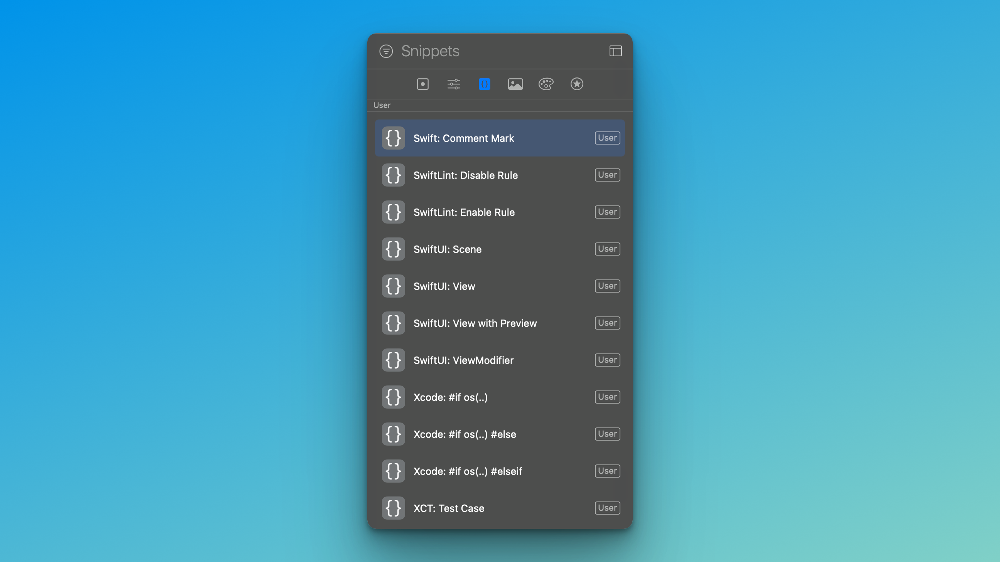

# Xcode CodeSnippets




To install these snippets open your terminal and execute:

```
cd ~/Library/Developer/Xcode/UserData
git clone https://github.com/phranck/Xcode-CodeSnippets.git CodeSnippets
```

## License
This software is published under the [MIT License](http://woodbytes.mit-license.org).